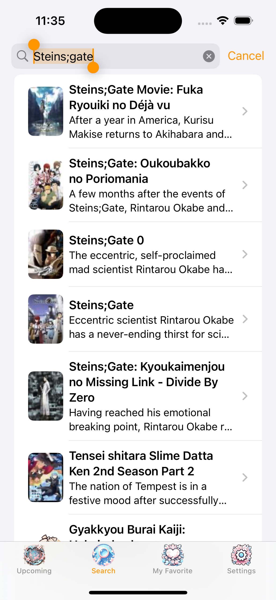
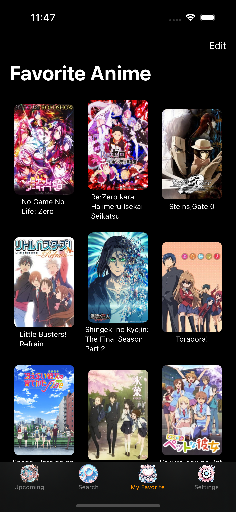
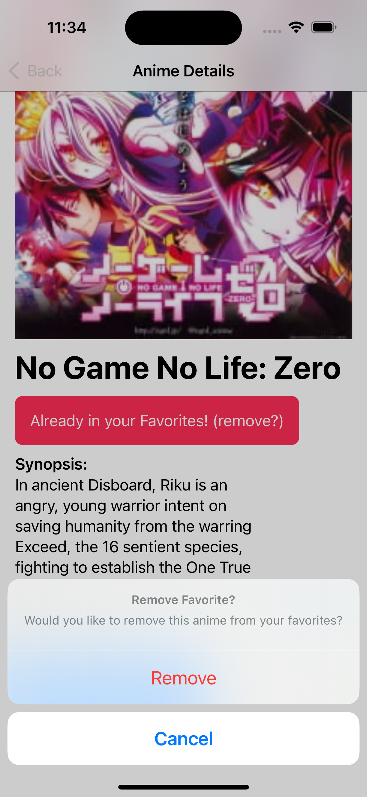
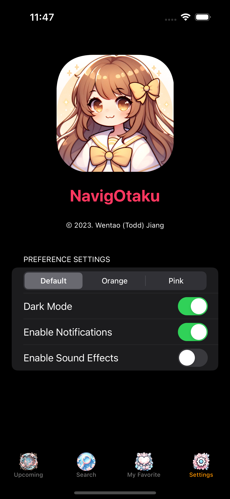

# Swift Application: NavigOtaku


## Project Information
#### Author: Wentao Jiang
#### Release Date: Dec.11, 2023
_Last Edit: Dec.27, 2023_


## Project Overview
**"NavigOtaku"** is an anime streaming application designed for discovering, viewing, and tracking anime content. The application encompasses the following key features:

1. **TopAnimeView and SearchView**: 
   - View top and upcoming anime.
   - Asynchronous search for current anime titles.

2. **FavoriteView**: 
   - Save and retrieve preferred anime with JSON persistence.

3. **DetailView and WebView Integration**: 
   - Comprehensive anime details including ratings, descriptions, trailers, etc.
   - WebView for additional web-based content.

4. **SettingsView with Customizable Options**: 
   - Customizable text color, dark/light mode, and notification/sound settings.

5. **Interactive UX Elements**: 
   - Reminders for anime shows with notifications.
   - Interactive sound effects and *hidden* animations throughout the application.

**"NavigOtaku"** combines essential streaming capabilities with user-centric features for a complete anime streaming experience.

## Screenshots
<div style="display: grid; grid-template-columns: repeat(2, 1fr); gap: 20px; max-width: 80%;">
  
  
  
  
</div>

## Development Environment
- **iOS Version**: Developed and tested on iOS 17.2 (21C62).
- **Xcode Version**: Xcode 15.1 (15C65).
- **Swift Version**: Swift 5.9.2 (swiftlang-5.9.2.2.56 clang-1500.1.0.2.5).
- **Swift Driver Version**: 1.87.3.
- **Compilation Target**: arm64-apple-macosx14.0.
- **Test Device**: iPhone 15 Pro.

## Installation Instructions
1. Clone this repository to your local machine.
2. Open `NavigOtaku.xcodeproj` in Xcode.
3. Build and run the project on a simulator or device.

## Copyright Info
- **API Query Usage**:
  - *MyAnimeList*, developed and maintained by [Felix Schmitt](https://rapidapi.com/felixeschmittfes/api/myanimelist).
- **Primary Website Displayed in WebView**:
  - [MyAnimeList](https://myanimelist.net/)
- **App Genre**: 
  - Entertainment
- **Application Developed by**:
  - &copy; 2023. [**Wentao Jiang**](https://wentaoj.github.io)
- **Visual Design**:
  - Icons and imagery designed by [Wentao Jiang](https://wentaoj.github.io/portfolio), further refined and generated using AI tools such as DALL-E and Stable Diffusion.


## Appendix
### Project Directory Structure:
```bash
.
├── Demo
│   ├── Demo.png
│   ├── Demo2.png
│   ├── Demo3.png
│   ├── Demo4.png
│   └── Demo5.png
├── Local
│   └── Keys.swift
├── NavigOtaku
│   ├── AnimeView
│   │   ├── GetDetails
│   │   │   ├── DetailHelper.swift
│   │   │   ├── DetailModel.swift
│   │   │   ├── DetailView.swift
│   │   │   └── WebView.swift
│   │   ├── MyFavorite
│   │   │   ├── FavoriteModel.swift
│   │   │   └── FavoriteView.swift
│   │   ├── SearchAnime
│   │   │   ├── SearchHelper.swift
│   │   │   ├── SearchModel.swift
│   │   │   └── SearchView.swift
│   │   └── TopAnime
│   │       ├── TopAnimeHelper.swift
│   │       ├── TopAnimeModel.swift
│   │       └── TopAnimeView.swift
│   ├── Assets.xcassets
│   │   ├── AccentColor.colorset
│   │   │   └── Contents.json
│   │   ├── AppIcon.appiconset
│   │   │   ├── App_Icon.png
│   │   │   └── Contents.json
│   │   ├── App_Icon.imageset
│   │   │   ├── App_Icon.png
│   │   │   ├── App_Icon@2x.png
│   │   │   ├── App_Icon@3x.png
│   │   │   └── Contents.json
│   │   ├── BackgroundColor.colorset
│   │   │   └── Contents.json
│   │   ├── Contents.json
│   │   ├── LaunchImg.imageset
│   │   │   ├── Contents.json
│   │   │   ├── LaunchImg.png
│   │   │   ├── LaunchImg@2x.png
│   │   │   └── LaunchImg@3x.png
│   │   ├── favorite.imageset
│   │   │   ├── Contents.json
│   │   │   ├── favorite.png
│   │   │   ├── favorite@2x.png
│   │   │   └── favorite@3x.png
│   │   ├── loading.imageset
│   │   │   ├── Contents.json
│   │   │   ├── loading.png
│   │   │   ├── loading@2x.png
│   │   │   └── loading@3x.png
│   │   ├── search.imageset
│   │   │   ├── Contents.json
│   │   │   ├── search.png
│   │   │   ├── search@2x.png
│   │   │   └── search@3x.png
│   │   ├── setting.imageset
│   │   │   ├── Contents.json
│   │   │   ├── settings.png
│   │   │   ├── settings@2x.png
│   │   │   └── settings@3x.png
│   │   └── topAnime.imageset
│   │       ├── Contents.json
│   │       ├── topAnime.png
│   │       ├── topAnime@2x.png
│   │       └── topAnime@3x.png
│   ├── ContentView.swift
│   ├── Info.plist
│   ├── NavigOtakuApp.swift
│   ├── Preview Content
│   │   └── Preview Assets.xcassets
│   │       └── Contents.json
│   ├── Settings
│   │   ├── BundleInfo.swift
│   │   ├── LoadingAnimation.swift
│   │   ├── NotificationManager.swift
│   │   ├── SettingsModel.swift
│   │   ├── SettingsView.swift
│   │   └── SoundManager.swift
│   ├── TabType.swift
│   └── あはは.mp3
├── NavigOtaku.xcodeproj
│   ├── project.pbxproj
│   ├── project.xcworkspace
│   │   ├── contents.xcworkspacedata
│   │   ├── xcshareddata
│   │   │   ├── IDEWorkspaceChecks.plist
│   │   │   └── swiftpm
│   │   │       └── configuration
│   │   └── xcuserdata
│   │       └── wentao.xcuserdatad
│   │           └── UserInterfaceState.xcuserstate
│   └── xcuserdata
│       └── wentao.xcuserdatad
│           ├── xcdebugger
│           │   └── Breakpoints_v2.xcbkptlist
│           └── xcschemes
│               └── xcschememanagement.plist
└── README.md

34 directories, 70 files
```